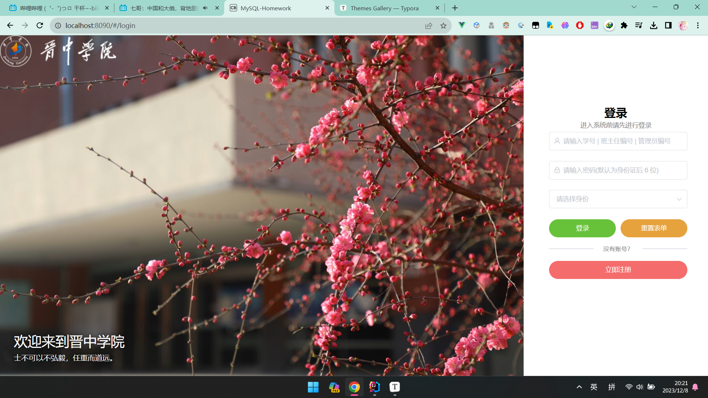
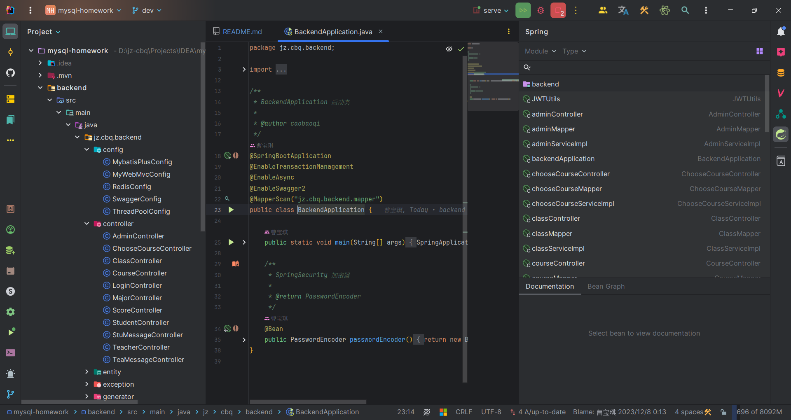
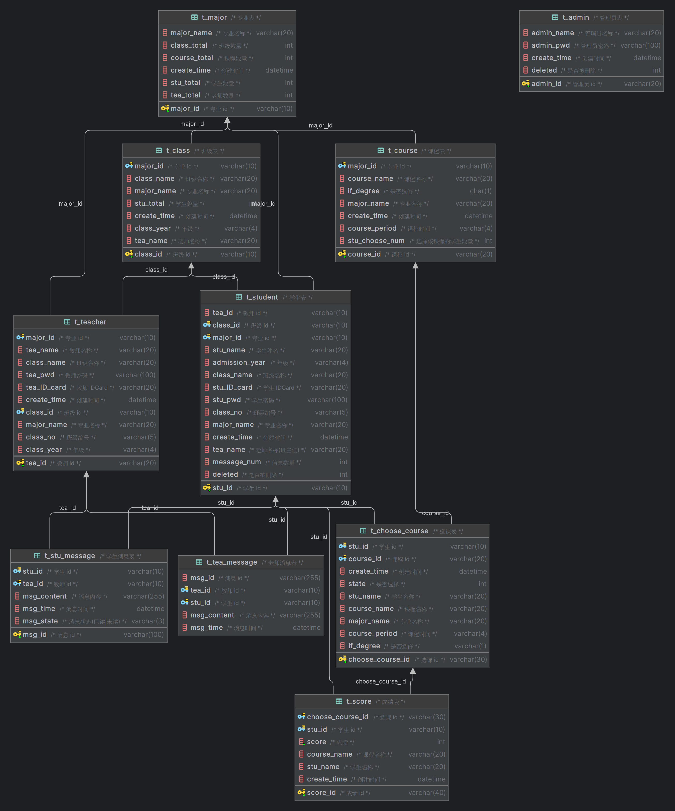

<a name="readme-top"></a>

<div align="center">
  <a href="https://gitee.com/cola777jz/mysql-homework">
    
  </a>
</div>
<h3 align="center">MySQL-Homework</h3>

<p align="center">
  MySQL-期末课程设计 (学生管理系统)
  <br />
  <a href="https://gitee.com/cola777jz/mysql-homework/tree/master/"><strong>项目文档</strong></a>
  <br />
  <br />
  <a href="https://gitee.com/cola777jz/mysql-homework/issues">Report Bug</a>
  ·
  <a href="https://gitee.com/cola777jz/mysql-homework/pulls">Request Feature</a>
</p>

## 关于

[](https://git.io/typing-svg)

### 前端



<p align="right">(<a href="#readme-top">back to top</a>)</p>

### 后端



<p align="right">(<a href="#readme-top">back to top</a>)</p>

### 数据库



<p align="right">(<a href="#readme-top">back to top</a>)</p>

### Built With

| 工具         | 版本       |
|------------|----------|
| IDEA       | 2023.3.X |
| JDK        | 1.8      |
| Maven      | 3.8.X    |
| SpringBoot | 2.7.10   |
| Vue        | 2.X      |
| MySQL      | 8.0      |

<p align="right">(<a href="#readme-top">back to top</a>)</p>

### Installation

> Clone the repo
>    ```sh
>    git clone https://gitee.com/cola777jz/mysql-homework.git
>    ```

> Docker
>
>   ```sh
>   docker-compose up
>   ```

> frontend
>    ```sh
>    npm install
>    ```

<p align="right">(<a href="#readme-top">back to top</a>)</p>

<!-- LICENSE -->

## License

Distributed under the  **Apache License 2.0** . See [LICENSE](LICENSE) for more information.

## Contact

| 邮箱 | 1203952894@qq.com |
|----|-------------------|

